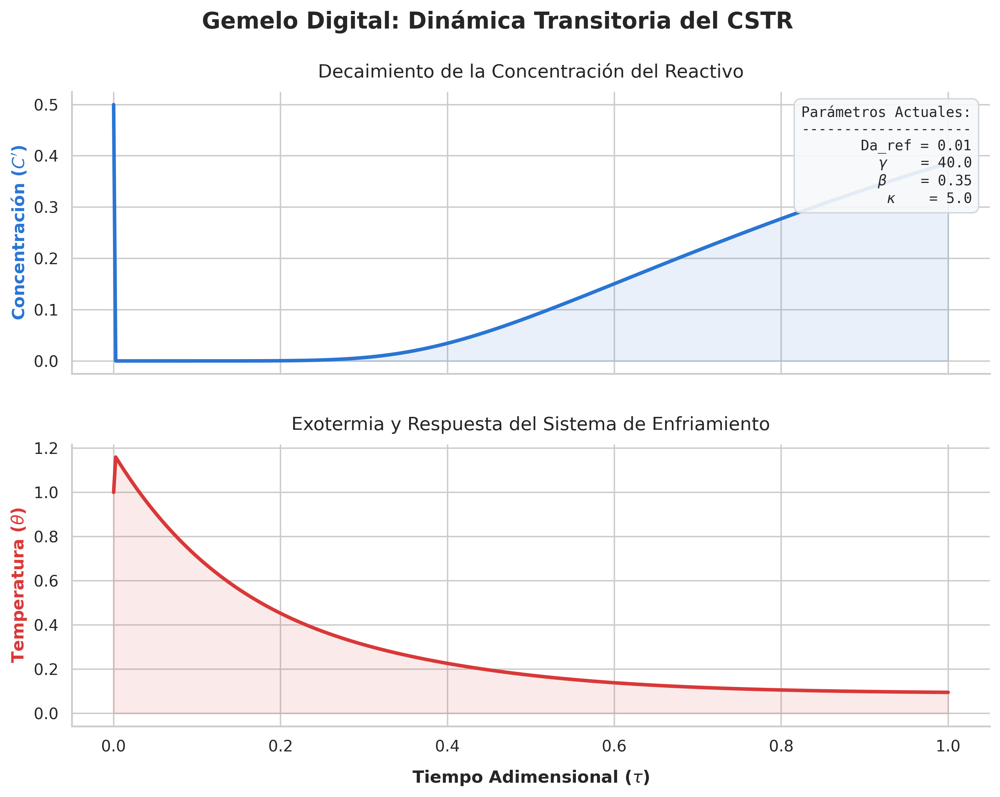

# 🏭 CSTR Digital Twin: Dynamic Simulation Engine

Este repositorio contiene el motor de simulación dinámica (el "Gemelo Físico") de un Reactor de Mezcla Completa (CSTR) no isotérmico.

Desarrollado en Python bajo una arquitectura orientada a objetos (OOP), este proyecto sirve como el modelo fundamental para la generación de datos sintéticos y el futuro entrenamiento de un Gemelo Digital basado en Machine Learning.



---

## 🛠️ Arquitectura del Proyecto

El código está estructurado en microservicios, separando la lógica matemática del integrador numérico y la configuración, asegurando alta escalabilidad.

```text
📦 DIGITAL_TWINS
├── 📂 .devcontainer/        # Entorno Dockerizado y configuraciones de VS Code
├── 📂 docs/                 # Documentación teórica y desarrollo matemático
├── 📂 src/
│   ├── 📂 common/
│   │   └── 📄 config.json   # Archivo centralizado de parámetros y escenarios
│   └── 📂 services/
│       ├── 📄 config_manager.py     # Gestor de inyección de configuraciones
│       ├── 📄 physics.py            # Clase con EDOs y cinética química
│       └── 📄 simulation_service.py # Integrador numérico (scipy.integrate)
├── 📄 main.ipynb            # Dashboard interactivo con ipywidgets y visualizaciones
└── 📄 requirements.txt      # Dependencias (numpy, scipy, pandas, seaborn, etc.)
```

---

## 🔬 Desarrollo Matemático del Modelo

### Consideraciones Iniciales

Se considera una reacción exotérmica elemental del tipo **A → B**.

La velocidad de reacción viene dada por **r = k·C_A**.

Se trabaja con un **modelo adimensional** para garantizar la estabilidad numérica de los solvers y facilitar el escalamiento industrial de los resultados:

- **Concentración:** $C_A = C' \cdot C_{A0}$
- **Tiempo:** $t = \tau \cdot \tau_{res}$
- **Tiempo de residencia:** $\tau_{res} = V/q$
- **Temperatura:** $T = T_{ref}(1 + \theta)$

> Se asume que la temperatura de referencia ($T_{ref}$) es equivalente a la temperatura del refrigerante ($T_c$).

---

### Ecuaciones Dimensionales Originales

**Balance de Masa:**

$$\frac{dC_A}{dt} = \frac{q}{V}(C_{A0} - C_A) - kC_A$$

**Balance de Energía:**

$$\frac{dT}{dt} = \frac{q}{V}(T_0 - T) + \frac{-\Delta H_{rxn}}{\rho C_p} kC_A - \frac{UA}{V\rho C_p}(T - T_c)$$

**Cinética (Arrhenius):**

$$k = A \exp\left(\frac{-E_a}{RT}\right)$$

---

### Ecuaciones Adimensionadas del Simulador

Para la implementación en código (`src/services/physics.py`), las ecuaciones se reducen a sus formas adimensionales fundamentales.

**Balance de Masa Adimensional:**

$$\frac{dC'}{d\tau} = 1 - C' - Da_0 \exp\left(\frac{-\gamma}{1+\theta}\right) C'$$

**Balance de Energía Adimensional:**

$$\frac{d\theta}{d\tau} = \theta_0 - \theta + \beta Da_0 \exp\left(\frac{-\gamma}{1+\theta}\right) C' - \kappa\theta$$

**Número de Damköhler Efectivo (Arrhenius):**

$$Da(\theta) = Da_0 \exp\left(\frac{-\gamma}{1+\theta}\right)$$

---

## 📊 Diccionario de Variables Adimensionales

| Parámetro | Símbolo | Fórmula de Origen | Rango Típico | Significado Físico y Notas de Diseño |
|---|---|---|---|---|
| Concentración | $C'$ | $C' = C_A / C_{A0}$ | 0 a 1 | Fracción de reactivo remanente. 1 significa reactor lleno de reactivo puro; 0 significa conversión del 100%. |
| Temperatura | $\theta$ | $\theta = (T - T_{ref}) / T_{ref}$ | 0 a 2 | Típicamente no supera el valor de 1 o 2 en fase líquida para evitar ebullición. Un θ muy alto indica descontrol térmico. |
| Tiempo | $\tau$ | $\tau = t / \tau_{res}$ | 0 a 10 | Representa cuántas veces se ha renovado el volumen ($\tau_{res} = V/q$). El estado estacionario suele alcanzarse entre τ = 3 y 5. |
| Energía de Activación | $\gamma$ | $\gamma = E_a / (RT_{ref})$ | 10 a 40 | Mide qué tan sensible es la reacción a los cambios de temperatura. Valores altos (> 30) disparan la reacción con poco calor. |
| Calor Adiabático | $\beta$ | $\beta = -\Delta H \cdot C_{A0} / (\rho C_p T_{ref})$ | 0.1 a 1.0 | Representa cuánto subiría la temperatura si el reactor estuviera aislado. Valores > 0.5 requieren enfriamiento robusto. |
| Enfriamiento | $\kappa$ | $\kappa = UA\tau_{res} / (V\rho C_p)$ | 0 a 5 | κ = 0 es un reactor adiabático. Valores entre 1 y 3 son comunes. κ > 5 aproxima a un comportamiento isotérmico. |
| Damköhler (Pre-exp) | $Da_0$ | $Da_0 = k_0 \cdot \tau_{res}$ | $10^6$ a $10^{15}$ | Número gigantesco para compensar el término de Arrhenius. Representa la velocidad teórica máxima a temperatura infinita. |
| Damköhler (Efectivo) | $Da_{ref}$ | $Da_{ref} = Da_0 \exp(-\gamma)$ | 0.01 a 10 | La velocidad real de reacción en $T_{ref}$. Si ronda entre 0.1 y 10, la reacción compite a la par con el flujo de entrada/salida. |

---

## 🚀 Cómo Empezar (Quick Start)

Este proyecto está configurado para ejecutarse instantáneamente utilizando **Devcontainers (Docker)**. No necesitas instalar Python ni dependencias en tu máquina local.

1. Clona este repositorio.
2. Abre la carpeta en **Visual Studio Code**.
3. Acepta la sugerencia de la ventana emergente: **Reopen in Container**.
4. Abre el archivo `main.ipynb` y ejecuta todas las celdas para interactuar con los sliders del modelo en tiempo real.